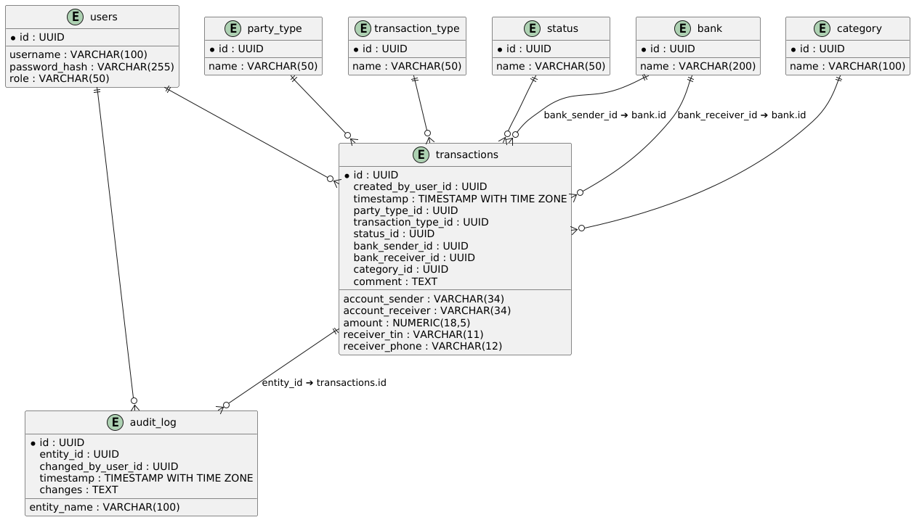
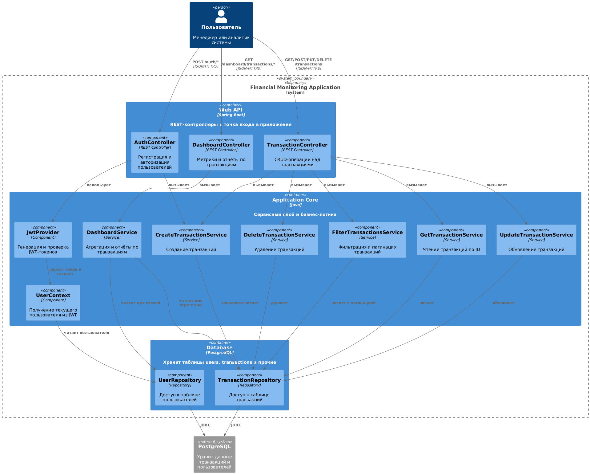
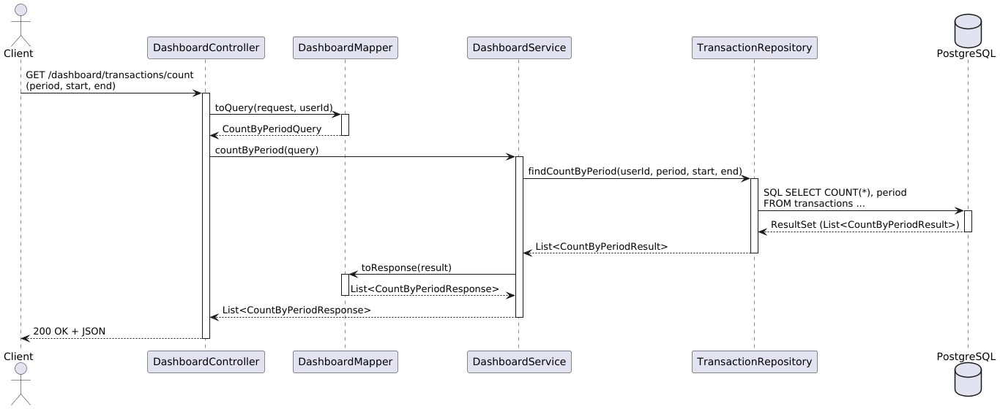

# Модель данных

Диаграмма ERD

# Архитектура сервиса

## 1 Цели и задачи системы

* **Надёжный REST‑API** для аутентификации, управления транзакциями и построения аналитики.
* **Масштабируемость** за счёт горизонтального масштабирования Web/API‑узлов.
* **Тестируемость** (unit тесты).
* **Гибкая расширяемость** — возможность безболезненно добавлять новые отчёты и бизнес‑сценарии.
* **Безопасность** — stateless‑аутентификация через JWT.

## 2 Слои Чистой архитектуры

1. **Web/API** — REST‑контроллеры (Auth, Transactions, Dashboard). Валидируют DTO, инициируют use case‑сервисы.
2. **Use Case** — сервисы бизнес‑логики (`CreateTransactionService`, `DashboardService`, и др.) работают с доменными
   сущностями через абстракции.
3. **Domain** — сущности (`Transaction`, `User`, и др.) без зависимостей от фреймворков; содержат бизнес‑правила.
4. **Persistence** — Spring Data JPA‑репозитории, Flyway‑миграции.
5. **Infrastructure & Cross‑cutting** — безопасность (JWT), логирование, валидация, документирование, мониторинг.

## 3 Применение SOLID

| Принцип | Реализация                                                                                            |
|---------|-------------------------------------------------------------------------------------------------------|
| **SRP** | Каждый класс решает одну задачу: Controller — HTTP, Service — use case, Repository — доступ к данным. |
| **OCP** | Добавление новых отчётов через расширение `DashboardService`, без изменения существующей логики.      |
| **LSP** | Моки сервисов/репозиториев подставляются в тестах (`@MockBean`) без нарушения контрактов.             |
| **ISP** | Контроллеры зависят только от нужных интерфейсов сервисов, а сервисы — от абстракций репозиториев.    |
| **DIP** | Высокоуровневые модули зависят от интерфейсов, а реализации внедряются Spring‑контейнером.            |

## 4 Ключевые паттерны и практики

* **DTO + MapStruct** — изоляция API и домена, автоматический маппинг.
* **Custom Validation** — `@DatePattern`, `@ValidPeriodRange` для сложных правил.
* **GlobalExceptionHandler** (`@ControllerAdvice`) — единый JSON‑формат ошибок.
* **Testcontainers** — real PostgreSQL в CI для интеграционных тестов.
* **OpenAPI** — `springdoc-openapi`; `@Schema`, `@ExampleObject` формируют читаемую документацию.

## 5 Поток обработки запроса (пример Dashboard)

1. Клиент отправляет `GET /dashboard/transactions/count` с параметрами `period`, `start`, `end`.
2. **DashboardController** валидирует `BasePeriodRequest`.
3. **DashboardMapper** формирует `CountByPeriodQuery`.
4. **DashboardService** агрегирует данные через `TransactionRepository`.
5. Mapper превращает результат в `CountByPeriodResponse`.
6. Контроллер возвращает JSON.

## 7 Заключение

Архитектура Financial Monitoring опирается на принципы Чистой архитектуры и SOLID:
слой Domain изолирован,
бизнес‑логика инкапсулирована в use case‑сервисах,
инфраструктурные детали вынесены на периферию. 

