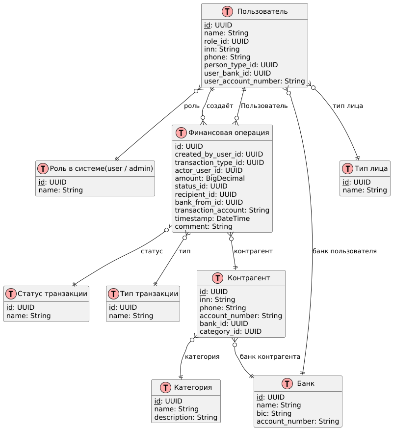
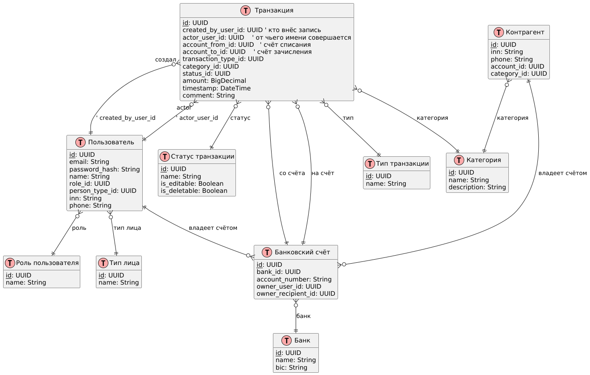

# ERD

## Старая схема

**Оценка соответствия диаграммы**

В диаграмме всё хорошо с сущностями и атрибутами, но есть некоторые проблемы:

1. Категория привязана к получателю, а должна быть связана с транзакцией.
2. Нужны поля для банков для отправителя и получателя.
3. Нет поддержки многовалютных операций.
4. Требуются учётные данные пользователей (логин, хеш пароля).
5. Не реализована валидация данных.
6. Отсутствуют решения для ограничения редактирования и контроля доступа.
7. Нужно добавить логирование интеграции и аудита.

Рекомендуется доработать модель с учётом этих замечаний.

### Итоги проверки

| Что требовалось по ТЗ                                            | Как это представлено в диаграмме                                                                  | Комментарий                                                                                                                                  |
|------------------------------------------------------------------|---------------------------------------------------------------------------------------------------|----------------------------------------------------------------------------------------------------------------------------------------------|
| **Справочники:** Person Type, Transaction Type, Category, Status | Таблицы `PersonType`, `TransactionType`, `Category`, `Status`                                     | Соответствует ТЗ.                                                                                                                            |
| **Пользователи и роли.** Аутентификация                          | Таблицы `User`, `Role`; связь `User` → `Role`                                                     | Роль есть, но для аутентификации нет полей login/email и password hash.                                                                      |
| **Банки‑участники** (банк отправителя/получателя)                | Таблица `Bank`; в `Transaction` - `bank_from_id`; в `Recipient`  - `bank_id`                      | Покрыт отправитель; получатель косвенно через `Recipient.bank_id`, что усложняет фильтрацию.                                                 |
| **Категория** должна относиться к транзакции                     | `Category` связан только с `Recipient`                                                            | Фильтр "по категории" придётся делать через join `Transaction→Recipient→Category`, а значит транзакции без контрагента не получат категорию. |
| **Счета:** счёт списания/зачисления и расчётный счёт получателя  | `Transaction.transaction_account` (вероятно счёт списания/зачисления), `Recipient.account_number` | Строгое разделение понятно, однако банку может принадлежать несколько расчётных счетов; лучше выделить сущность **Account**.                 |
| **ИНН и телефон получателя**                                     | `Recipient.inn`, `Recipient.phone`                                                                | Есть, но валидационные ограничения (длина, маска) не заданы как check‑constraints.                                                           |
| **Статусы, ограничения на редактирование/удаление**              | `Status`; связь `Transaction→Status`                                                              | Статус есть. Чтобы реализовать бизнес‑правила, полезно добавить флаг `is_editable`, `is_deletable` в `Status`.                               |
| **Даты/время**                                                   | `Transaction.timestamp`                                                                           | Соответствует.                                                                                                                               |
| **Дашборды (агрегации)**                                         | Нужны поля для суммы (`amount`), даты (`timestamp`) и статуса - всё есть                          | Ок.                                                                                                                                          |
| **Аудит/логи**                                                   | отсутствуют                                                                                       | В ТЗ упоминалась выгрузка audit log / integration log; если нужны, добавить отдельные таблицы.                                               |

### Основные замечания и рекомендации

#### **Категория должна быть атрибутом транзакции.**

  Добавить `category_id` в`Transaction`; связь `Recipient→Category` можно оставить (категоризация контрагента), но для
  фильтров и дашбордов категории расходов/поступлений проще брать напрямую из транзакций.

#### **Разделить понятия "банк" и"счёт".**

  Создайть таблицу `Account`(`id`, `bank_id`, `account_number`, …) и связать:
  - `User`→`Account` (у пользователя может быть несколько счетов)
  - `Recipient`→`Account`
  - `Transaction`→`Account`(отправительский) и/или `Account`(получательский).

#### **Добавить банк‑получатель на уровне транзакции.**
  Сейчас `bank_from_id` есть, а для получателя приходится идти через `Recipient.bank_id`. Явное поле `bank_to_id`
  упрощает фильтрацию "по банку получателя".

#### **Аутентификация.**
  В`User` стоит хранить `email` (уникально), `password_hash`, возможно `is_active`, дату регистрации. Это не относится к
  ER‑логике финансового домена, но необходимо для требования "реализовать аутентификацию".

#### **Бизнес‑ограничения по статусам.**
  Чтобы не"раскидывать" логику по коду, можно добавить в`Status` логические флаги или атрибут `allowed_actions` (JSON) -
  так проще контролировать, какие операции допустимы над транзакцией при данном статусе.

#### **Связь`Transaction → User`.**
  В диаграмме есть и `created_by_user_id`, и `actor_user_id`. Если они действительно различаются (например, бухгалтер
  вводит транзакцию за другого пользователя), опишите семантику в документации.

#### **Нормализация "Bank.account_number".**
  Расчётный счёт банка ("корсчёт" в ЦБ) не участвует в отчётах и далее не используется - можно убрать (или вынести в
  таблицу `CorrespondentAccount`), чтобы не засорять `Bank`.

## Новая схема

